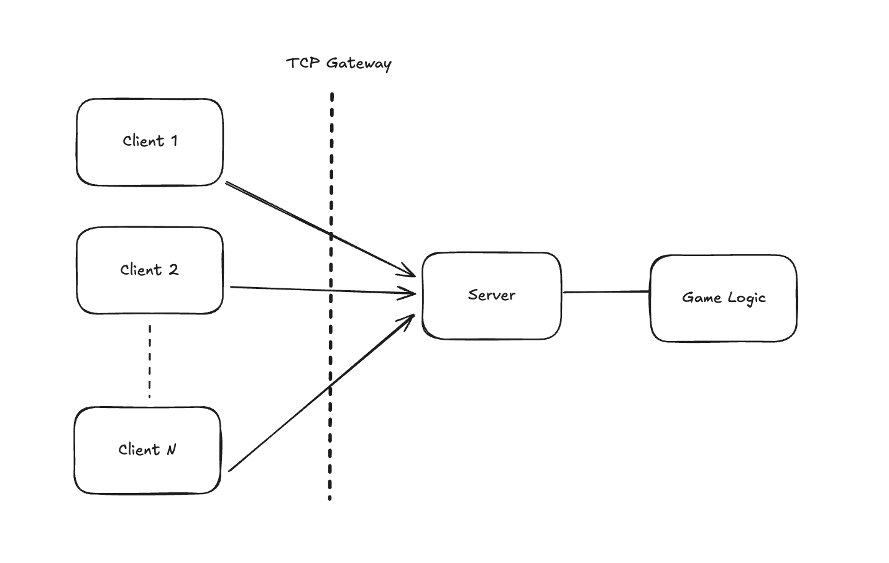

# tic-tac-toe
A simple networked Tic-Tac-Toe game implemented in Go using a client–server architecture. The server accepts multiple TCP connections, pairs clients into games, and manages game state and turn logic. Clients connect via the terminal, send moves, and receive real-time game updates.

## Project Setup

### 1. Clone Project
* git clone https://github.com/tilakpeace/tic-tac-toe.git

### 2. Check Go version
* go version

### 3. Run Server in one terminal
* go run ./server

### 4. Run Server in multiple terminals

* go run ./client

## Project Overview

The application consists of two separate programs:

### 1. Server

* Runs as a single instance

* Listens for incoming TCP connections

* Accepts multiple clients

* Pairs two clients into a game

* Maintain waiting if client is not get paired

* Controls game rules and turns

### 2. Client

* Connects to the server over TCP

* Displays the game board in the terminal

* Takes user input (row & column)

* Sends moves to the server

* Receives opponent moves and game results

## System Architecture Diagram

### Explanation:

* One server runs continuously

* Multiple clients connect to it

* Server manages all game rules

* Clients only send moves and display results

## How the Game Works

* The server waits until two clients connect

* Each player is assigned a symbol (X or O)

* Players take turns entering moves

* The server validates moves

* The game ends when:

    * A player wins, or

    * The board is full (draw)

## Possible Improvements

* Add reconnect support

* Add spectator mode

* Improve error handling

* Add WebSocket or HTTP support

* Add UI (web or desktop)    

